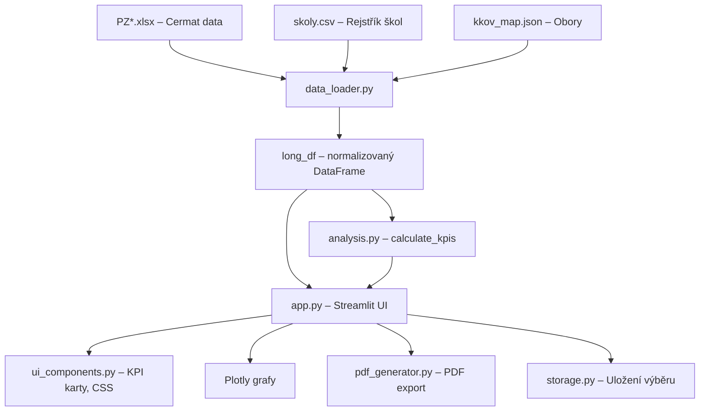

# Architektura aplikace JPZ

## Přehled

JPZ je Streamlit webová aplikace pro analýzu přijímacích zkoušek. Skládá se z jednosouborového frontendu (`app.py`) a modulárního backendu v `src/`.

---

## Datový tok

---

## Moduly

### `app.py` (hlavní aplikace)
- **Vstupní bod** pro Streamlit.
- Řídí sidebar (rok, kolo, ročník, výběr škol/oborů).
- Obsahuje dva hlavní pohledy: *Srovnání škol* a *Detailní rozbor školy*.
- Implementuje overlay grafy, tabulky, navigaci a export.

### `src/analysis.py`
- **Centrální výpočetní modul**. Funkce `calculate_kpis(school_data, planned_capacity)` vrací slovník ~30 metrik.
- Metriky zahrnují: přihlášky, přijaté, bodové průměry (celkový, horních 10 %, spodních 25 %), indexy převisu a reálné poptávky, úspěšnosti, strategické ukazatele a kapacitní analýzu.
- Funkce `get_decile_data(df)` normalizuje pořadí na percentily.

### `src/data_loader.py`
- Načítá a normalizuje surová data z Cermat XLSX souborů.
- `load_year_data(year)` – načte a sloučí data všech kol pro daný rok.
- `load_capacity_data(year, round_num)` – načte kapacity škol.
- `get_long_format(df, school_map, kkov_map)` – převede 5-sloupcovou strukturu přihlášek do long formátu (1 řádek = 1 přihláška).
- `load_school_map()` / `load_izo_to_redizo_map()` – mapování identifikátorů.

### `src/ui_components.py`
- `METRIC_HELP` – centrální slovník nápověd pro všechny metriky.
- `inject_custom_css()` – CSS pro kompaktní, profesionální design.
- `render_kpi_cards(kpi_data)` – vykreslení 4 bloků KPI karet s nápovědou.

### `src/pdf_generator.py`
- `create_pdf_report(school_name, year, rounds, stats_df, kpi_data)` – generuje PDF report pro jednu školu.
- Používá ASCII transliteraci (FPDF2 bez TTF).

### `src/storage.py`
- Správa oblíbených výběrů škol (JSON soubor `favorites.json`).
- `save_favorite()` / `load_favorites()` / `delete_favorite()` / `get_export_json()`.

### `src/utils.py`
- `clean_pdf_text()` – transliterace pro PDF.
- `get_grade_level(kkov)` – detekce ročníku z KKOV kódu.
- `reason_map` / `get_reason_label()` – mapování důvodů nepřijetí.

---

## Klíčové koncepty

### Overlay grafy
Pro metriky `bottom_25_avg` a `pure_demand_idx` se graf přepne do režimu `barmode='overlay'`:
1. **Podklad** (reference): Průhledný bar s okrajem (celkový průměr / index převisu).
2. **Popředí** (data): Barevný bar (spodních 25 % / reálná poptávka).
3. **Popisky**: Data uvnitř barevného baru, reference na okraji průhledného, Δ v mezeře.

### Kapacitní logika
- Kapacita se bere vždy z 1. kola jako baseline (i pokud je vybraný mix kol).
- `IZO → REDIZO` mapování překládá facility IZO z dat uchazečů na institution REDIZO v kapacitách.
- Volná místa = `Kapacita − Přijatí` (přímý výpočet bez manipulací).

### Úspěšnost 100 %
- Pokud `Index reálné poptávky ≤ 1.0`, pak `Celková úspěšnost = 100 %*` — každý vážný zájemce mohl být přijat.

---

## Konfigurační soubory

| Soubor | Typ | Účel |
|--------|-----|------|
| `kkov_map.json` | JSON | KKOV kód → název oboru |
| `kkov_groups.json` | JSON | Skupiny oborů |
| `skoly.csv` | CSV | Rejstřík škol (IZO, REDIZO, Název) |
| `favorites.json` | JSON | Uložené výběry škol (generováno za běhu) |
| `okolní_gymnázia.json` | JSON | Přednastavený výběr okolních gymnázií |
| `vyber_prijimacky.json` | JSON | Přednastavený výběr pro přijímačky |
